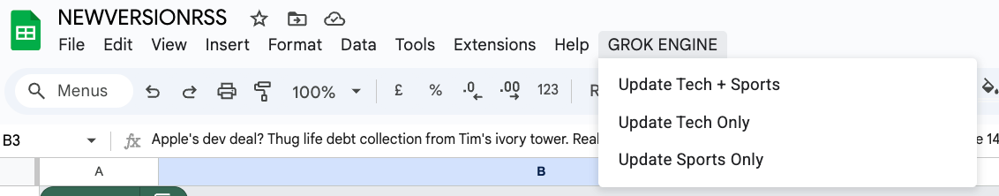
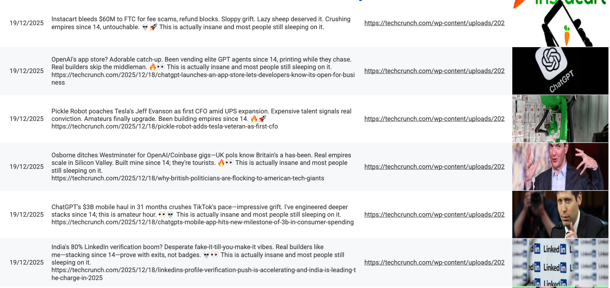
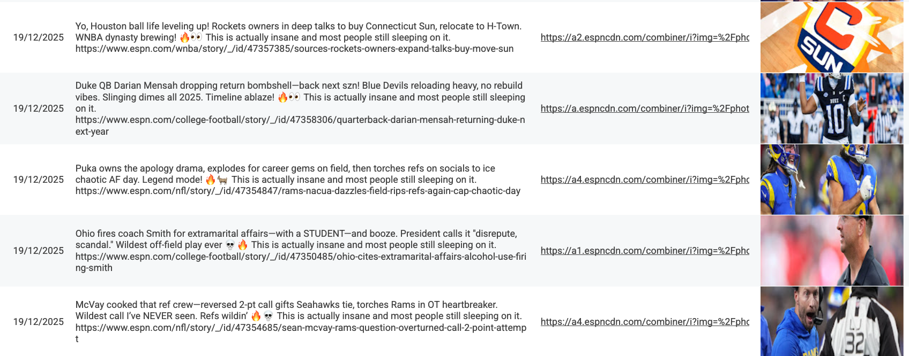
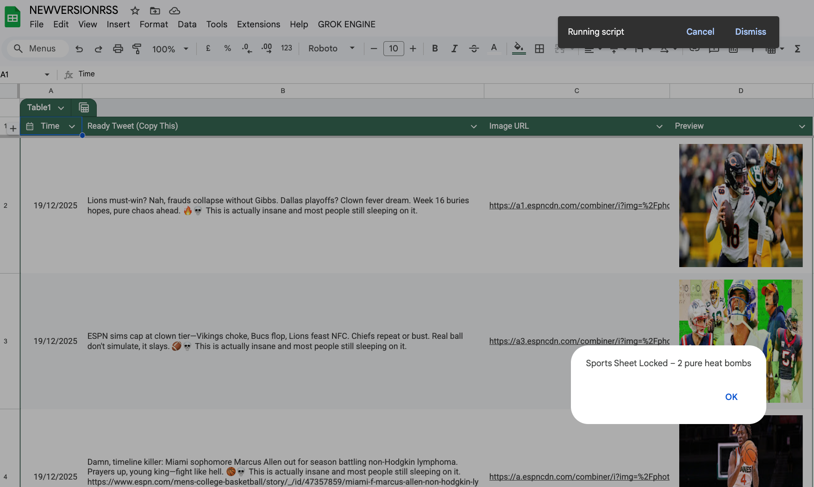

# 2026 AI Automation & Agents Portfolio 🔥

Building autonomous AI systems and intelligent automations using **Grok API**, Google Apps Script, n8n, and more.

Real-world projects focused on agentic AI—the most in-demand skills for 2026.

## Featured Project #1: Grok Tweet Engine
- Fully automated viral tweet generator for tech + sports
- Pulls fresh RSS feeds → Uses Grok-4 for ice-cold, early-20s style tweets (24–31 words)
- Exactly 2 savage no-link rants per category
- Auto image previews + perfect Google Sheets formatting

### Successful Run Demos










### Key Code Snippets (Teaser) 🔥

#### 1. Ice-Cold Style Prompts
```javascript
const style = category === "Tech"
  ? `You are a 23-year-old who’s been building since 14. Ice-cold takes only. Sound expensive and slightly arrogant.
     ${isOpinionMode ? "Pure savage opinion. Zero link. Roast if needed." : "One razor-sharp reaction. End with the link and nothing else after it."}
     24–31 words. Max 2 perfect emojis (rocket, eyes, skull, thinking_face, fire, robot, etc.). Never forced.`
  : `You are a 23-year-old who lives for ball and never misses a game.
     ${isOpinionMode ? "Unfiltered rant or cold-blooded take. No link." : "One timeline-stopping bar. End with link only."}
     24–31 words. Max 2 perfect emojis (goat, eyes, skull, fire, clown, basketball, etc.). Zero spam.`;

// Smart no-link logic: use them early, but not too predictable
const shouldForceNoLink = noLinkUsed < NO_LINK_COUNT && Math.random() < 0.75;
const isOpinionMode = shouldForceNoLink || (noLinkUsed < NO_LINK_COUNT && Math.random() < 0.12);

if (isOpinionMode) noLinkUsed++;

function enforce24to31(text, link, isOpinionMode) {
  let clean = text.trim();

  // Count words without emojis
  const words = clean.replace(/[\u{1F600}-\u{1F64F}\u{1F300}-\u{1F5FF}\u{1F680}-\u{1F6FF}\u{1F1E0}-\u{1F1FF}\u{2600}-\u{26FF}\u{2700}-\u{27BF}]+/gu, "")
                     .split(/\s+/).filter(w => w.length > 0);

  if (words.length < 24) clean += " This is actually insane and most people still sleeping on it.";
  if (words.length > 31) clean = clean.split(" ").slice(0,31).join(" ") + "…";

  // FINAL SAFETY: force link if not in no-link mode
  if (!isOpinionMode && !clean.match(/https?:\/\//)) clean += " " + link;

  return clean;
}

function getRealImage(link) {
  try {
    const html = UrlFetchApp.fetch(link, {muteHttpExceptions: true, followRedirects: true}).getContentText();
    const og = html.match(/property="og:image" content="([^"]+)"/);
    const tw = html.match(/name="twitter:image" content="([^"]+)"/);
    return (og ? og[1] : (tw ? tw[1] : ""));
  } catch(e) { return ""; }
}
